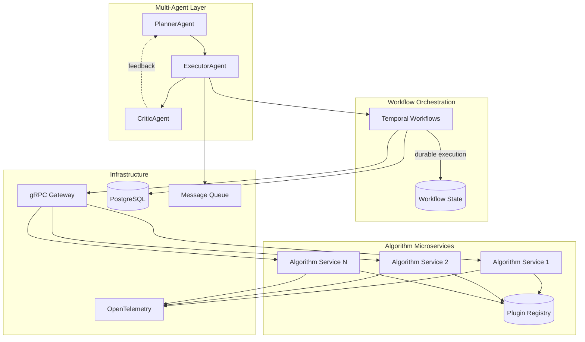

# HelixCore

An open-source framework for interdisciplinary R&D pipelines, seamlessly integrating wet-lab experiments, AI algorithms, and simulations.

📖 **[中文介绍 - 了解框架如何智能调度专家模型](docs/framework-overview-cn.md)**



## Features

- **Plug-and-play Algorithm Microservices**: Container-based services with standardized manifests
- **Multi-Agent Reasoning**: LLM-powered Planner/Executor/Critic for intelligent orchestration
- **Durable Workflows**: Fault-tolerant, replayable execution via Temporal
- **Observable by Design**: Built-in metrics, traces, and logs with OpenTelemetry
- **Clean Architecture**: DDD principles with clear separation of concerns

## Quick Start

### Prerequisites

- Python 3.11+
- Docker & Docker Compose
- Kubernetes cluster (for production)
- Temporal server

### Installation

```bash
# Clone the repository
git clone https://github.com/helixcore/helixcore.git
cd helixcore

# Install dependencies
pip install -e ".[dev]"

# Generate protobuf files
python scripts/generate_proto.py

# Run tests
pytest

# Start local development environment
docker-compose up -d
```

### Creating an Algorithm Service

1. Create a new algorithm directory:
```bash
mkdir -p algorithms/my_algorithm
cd algorithms/my_algorithm
```

2. Create `manifest.yaml`:
```yaml
name: my_algorithm
version: 0.1.0
entrypoint: "python -m algorithms.my_algorithm.service"
inputs:
  - name: data
    type: array
    required: true
outputs:
  - name: result
    type: float
resources:
  cpu: 2
  memory: "4Gi"
license: MIT
```

3. Implement the service:
```python
from helixcore.algorithms.base import BaseAlgorithmService

class MyAlgorithmService(BaseAlgorithmService):
    async def predict(self, task_spec):
        # Your algorithm logic here
        data = task_spec.input_payload.get("data")
        result = process_data(data)
        return {"result": result}

if __name__ == "__main__":
    service = MyAlgorithmService(
        name="my_algorithm",
        version="0.1.0"
    )
    service.serve()
```

4. Register and deploy:
```bash
helixctl plugins publish ./algorithms/my_algorithm
```

## Architecture

HelixCore follows Clean Architecture principles with clear layer separation:

- **Domain Layer**: Pure business logic, no framework dependencies
- **Application Layer**: Use cases and orchestration logic
- **Infrastructure Layer**: External integrations (DB, messaging, Temporal)
- **Interface Layer**: API contracts (gRPC, REST, CLI)

## Development

### Code Quality

We enforce strict code quality standards:

```bash
# Format code
black helixcore/

# Lint code
ruff check helixcore/

# Type check
mypy helixcore/

# Run all checks
make lint
```

### Testing

```bash
# Unit tests
pytest tests/unit/

# Integration tests
pytest tests/integration/

# End-to-end tests
pytest tests/e2e/

# Coverage report
pytest --cov=helixcore --cov-report=html
```

## Deployment

### Kubernetes

```bash
# Install with Helm
helm install helixcore charts/helixcore/

# Upgrade
helm upgrade helixcore charts/helixcore/

# Monitor
kubectl get pods -n helixcore
```

### Configuration

HelixCore uses environment variables following the 12-factor app methodology:

- `TEMPORAL_HOST`: Temporal server address
- `DATABASE_URL`: PostgreSQL connection string
- `OTEL_EXPORTER_OTLP_ENDPOINT`: OpenTelemetry collector endpoint
- `HELIXCORE_LOG_LEVEL`: Logging level (DEBUG, INFO, WARNING, ERROR)

## Contributing

We welcome contributions! Please see our [Contributing Guide](CONTRIBUTING.md) for details.

## License

HelixCore is licensed under the MIT License. See [LICENSE](LICENSE) for details.

## Support

- Documentation: https://docs.helixcore.io
- Issues: https://github.com/helixcore/helixcore/issues
- Discussions: https://github.com/helixcore/helixcore/discussions