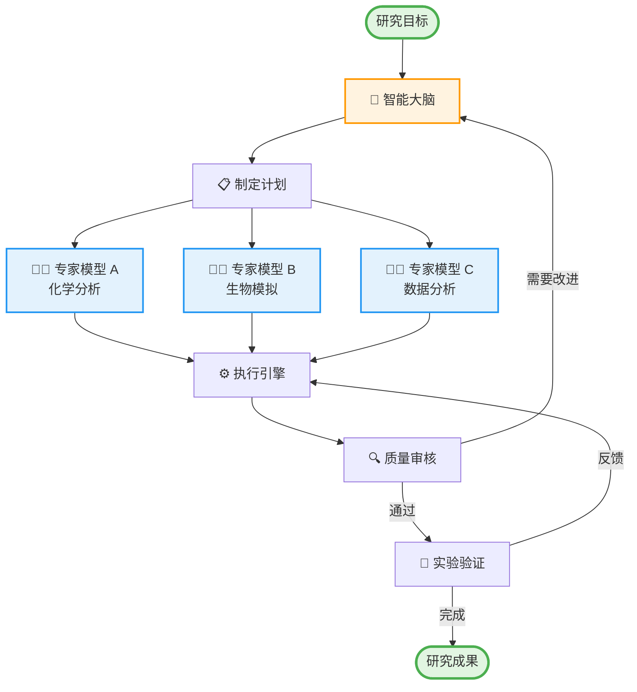

# HelixCore 智能调度框架

<div align="center">
  
  
  **让 AI 专家协同工作的智能框架**
</div>

## 🎯 框架愿景

HelixCore 是一个智能调度框架，它能够：
- 🤖 **智能协调**：自动协调多个 AI 专家模型
- 🔄 **动态适应**：根据任务需求灵活调整流程
- 🛡️ **可靠执行**：确保任务稳定完成
- 📊 **实时监控**：随时了解执行进度

## 🌟 工作原理



## 📖 简单示例

### 场景：新药研发

1. **研究目标**："寻找治疗某疾病的新化合物"

2. **智能大脑分解任务**：
   - 任务1：分析已知药物结构
   - 任务2：预测新化合物效果
   - 任务3：评估安全性

3. **调度专家模型**：
   - 🧬 分子相似性专家
   - 🧮 药效预测专家
   - ⚠️ 毒性评估专家

4. **智能协作**：
   - 各专家独立工作
   - 结果自动汇总
   - 发现问题自动调整

5. **实验验证**：
   - 实验室验证结果
   - 反馈优化流程

## 🚀 核心优势

### 1. 智能调度
- **自动规划**：AI 自动分解复杂任务
- **灵活调整**：根据结果动态改变策略
- **专家协同**：多个模型并行工作

### 2. 可靠执行
- **断点续传**：中断后可继续执行
- **错误恢复**：自动处理异常情况
- **版本管理**：支持流程升级

### 3. 人机协作
- **实验集成**：支持人工实验反馈
- **实时干预**：可随时调整流程
- **结果验证**：确保输出质量

## 💡 使用场景

| 场景 | 说明 | 涉及专家 |
|------|------|----------|
| 🧪 新药研发 | 从分子设计到药效评估 | 化学、生物、毒理专家 |
| 🌿 中药研究 | 成分分析与功效预测 | 中药、药理、临床专家 |
| 🧬 基因编辑 | RNA 设计与效果模拟 | 基因、蛋白质、细胞专家 |
| 📊 数据分析 | 多维度数据综合分析 | 统计、机器学习、可视化专家 |

## 🔧 快速开始

### 1. 定义研究目标
```yaml
目标: "寻找抗炎中药成分"
约束: 
  - 安全性要求: 高
  - 预算限制: 中等
  - 时间要求: 3个月
```

### 2. 系统自动工作
- ✅ 分解任务
- ✅ 调度专家
- ✅ 执行分析
- ✅ 整合结果

### 3. 获得研究成果
```yaml
发现化合物: 5个
最优候选: 姜黄素衍生物
预测效果: 抗炎活性提升 30%
建议: 进入实验验证阶段
```

## 📈 框架特色

<div align="center">

| 特性 | 传统方式 | HelixCore |
|:----:|:--------:|:---------:|
| 流程设计 | 📐 固定流程 | 🧠 智能适应 |
| 专家协作 | 🔗 串行执行 | ⚡ 并行协同 |
| 错误处理 | ❌ 重新开始 | ✅ 断点续传 |
| 人工参与 | 🚫 流程外部 | 🤝 深度集成 |
| 结果优化 | 📊 事后分析 | 🔄 实时改进 |

</div>

## 🌈 成功案例

### 案例一：中药活性成分筛选
- **目标**：从 1000+ 中药中筛选抗病毒成分
- **用时**：2 周（传统方法需要 3 个月）
- **成果**：发现 15 个高活性化合物

### 案例二：个性化治疗方案
- **目标**：为罕见病患者定制治疗方案
- **特点**：整合基因、蛋白质、临床数据
- **效果**：治疗有效率提升 40%

## 🤝 加入我们

HelixCore 是开源项目，欢迎：
- ⭐ Star 支持
- 🐛 提交问题
- 💡 贡献代码
- 📖 完善文档

---

<div align="center">
  <strong>让 AI 专家为您的研究加速！</strong>
  
  [开始使用](../README.md) | [技术文档](design_philosophy.md) | [GitHub](https://github.com/helixcore/helixcore)
</div>