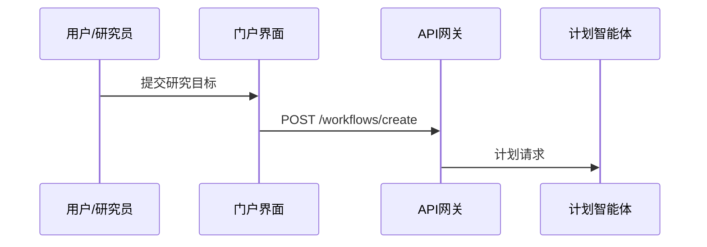
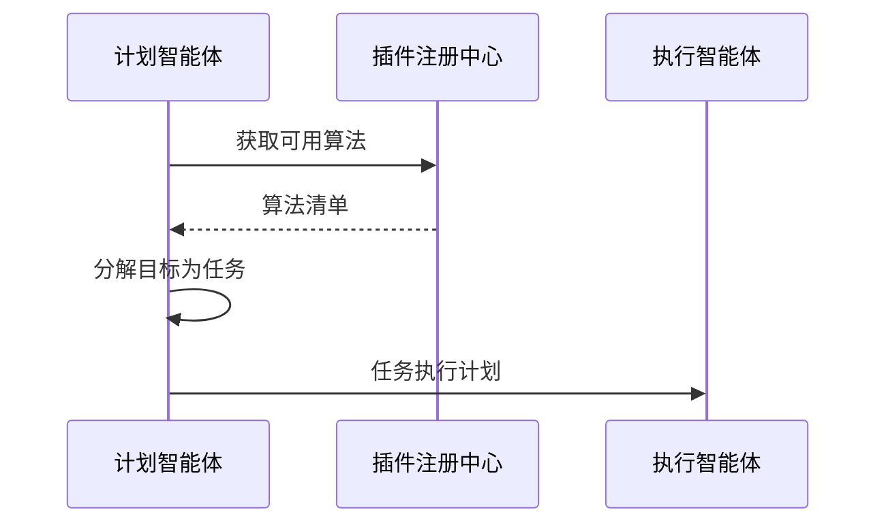
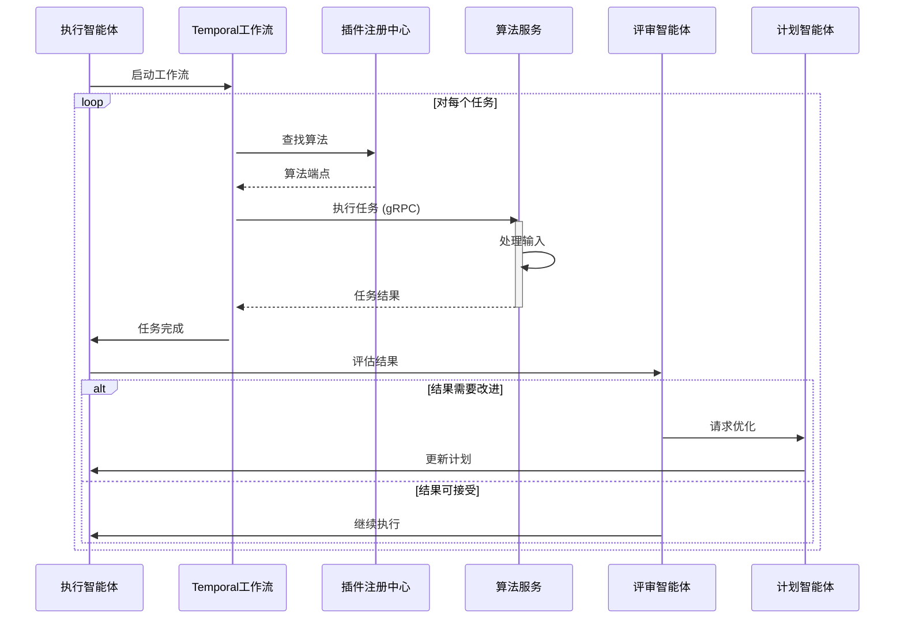
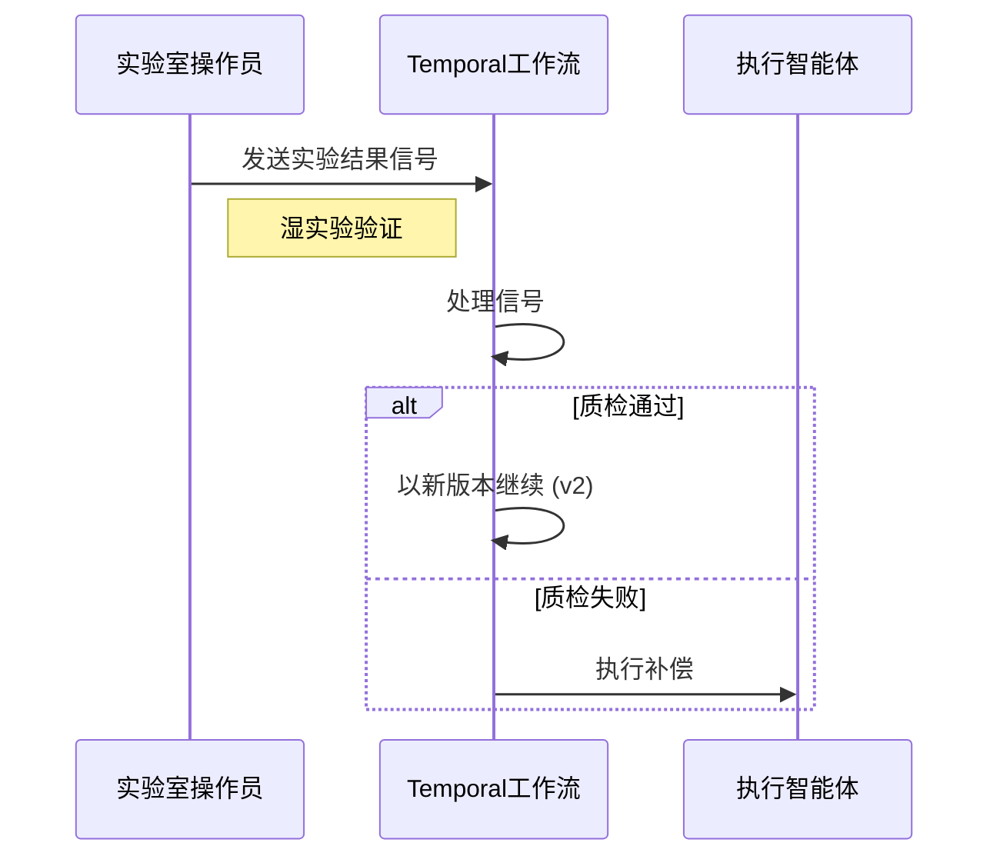

# HelixCore 多智能体工作流执行序列

## 参与组件

| 组件 | 说明 |
|------|------|
| **用户/研究员** | 提交研究目标的终端用户 |
| **门户界面** | Web 用户界面 |
| **API 网关** | 统一的 API 入口 |
| **计划智能体** | 负责分解任务和制定计划 |
| **执行智能体** | 负责协调任务执行 |
| **评审智能体** | 负责评估结果质量 |
| **Temporal 工作流** | 持久化工作流引擎 |
| **算法服务** | 具体的算法实现微服务 |
| **插件注册中心** | 算法服务注册管理 |
| **实验室操作员** | 进行湿实验的人员 |

## 执行流程

### 1. 初始化阶段



### 2. 规划阶段



### 3. 执行阶段



### 4. 人机协作阶段



### 5. 完成阶段

```mermaid
sequenceDiagram
    participant Temporal as Temporal工作流
    participant Executor as 执行智能体
    participant API as API网关
    participant UI as 门户界面
    participant User as 用户/研究员
    
    Temporal->>Executor: 工作流完成
    deactivate Temporal
    Executor->>API: 最终结果
    API->>UI: 显示结果
    UI->>User: 研究完成
```

## 关键交互说明

### 初始化
- 用户通过 Web 界面提交研究目标
- API 网关接收请求并转发给计划智能体

### 规划
- 计划智能体从注册中心获取所有可用的算法服务
- 使用 LLM 能力将研究目标分解为可执行的任务序列
- 生成详细的执行计划并交给执行智能体

### 执行
- 执行智能体通过 Temporal 启动持久化工作流
- 工作流对每个任务：
  - 从注册中心查找对应的算法服务
  - 通过 gRPC 调用算法服务执行具体任务
  - 将结果交给评审智能体评估
  - 根据评估结果决定是继续还是优化

### 人机协作
- 实验室人员可以随时向工作流发送实验结果
- 工作流根据质检结果决定：
  - 通过：升级版本继续执行
  - 失败：执行补偿逻辑

### 完成
- 所有任务执行完毕后，工作流将最终结果返回
- 结果通过 API 网关传递到用户界面
- 用户获得完整的研究成果

## 特性亮点

1. **智能决策**：多智能体协作，动态调整执行策略
2. **持久执行**：Temporal 确保工作流状态持久化，支持故障恢复
3. **灵活扩展**：通过插件注册中心动态添加新算法
4. **人机结合**：支持实验验证结果实时反馈到工作流
5. **质量保证**：评审智能体确保每步结果的质量